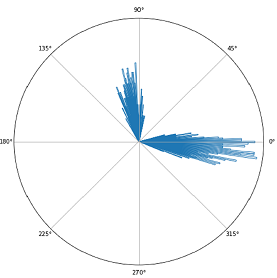
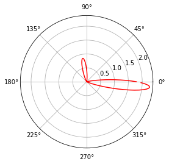
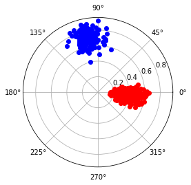
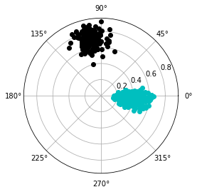

    __        ______ __  __ __  __  
    \ \      / / ___|  \/  |  \/  | 
     \ \ /\ / / |  _| |\/| | |\/| | 
      \ V  V /| |_| | |  | | |  | | 
       \_/\_/  \____|_|  |_|_|  |_| 

# WGMM (Wrapped Gaussian Mixture Model) for angular (circular) clustering

An implementation of the `WGMM` in Thesis [`Speech Enhancement using Fiber Acoustic Sensor`](https://spectrum.library.concordia.ca/id/eprint/986722/1/Miao_MASc_S2020.pdf) at Concordia University.

    @mastersthesis{wang2020speech,
    title={Speech Enhancement using Fiber Acoustic Sensor},
    author={Wang, Miao},
    year={2020},
    school={Concordia University},
    url={https://spectrum.library.concordia.ca/id/eprint/986722/1/Miao_MASc_S2020.pdf}}

The `WGMM` here is designed to solve the phase ambiguity between `0` and `T`, which could be any positive value like  and . 

# Install

install this code using pip:
```bash
pip install https://github.com/ludlows/wgmm/archive/refs/heads/main.zip
```

install this code using `setup.py` 
```commandline
python setup.py install
```

# Example-1: angular clustering in a polar coordinate


| distribution of synthesized angular (circular) values | probability density function (PDF) obtained by WGMM |
|:-----------------------------------------------------:|:---------------------------------------------------:|
|              |            |

Python code to `fit` these synthesized values is shown below:
```python
# import modules
import numpy as np
from wgmm import WGMixModel

# set initial values
weights_init = np.array([0.5,0.5])
means_init = np.array([[270.0],[180.0]]) / 180.0 * np.pi
covars_init = np.zeros((2,1,1))
covars_init[0,0,0] = 0.8
covars_init[1,0,0] = 0.8
periods = np.array([2*np.pi])

# build model
model = WGMixModel(n_components=2, weights_init=weights_init, 
                   means_init=means_init, covars_init=covars_init, 
                   periods=periods, 
                   tol=1e-4, reg_covar=1e-6, max_iter=1000)

# fit samples
model.fit(samples)

# print parameters estimated by WGMM
print(model.means_ / np.pi * 180) # 355.13560655, 99.36977191
print(model.weights_)
print(model.covars_)
```
details about this example could be found in this [notebook](example/example-01-angular-clustering-in-polar-coordinate.ipynb).

# Example-2: clustering samples in a polar coordinate

Here we show an example to cluster heterogeneous samples (angles are circular and radius not).

|     polar plot of synthesized dataset     |         clusters obtained by WGMM         |
|:-----------------------------------------:|:-----------------------------------------:|
|  |  |


details about this example could be found in this [notebook](example/example-02-clustering-samples-in-a-polar-coordinate.ipynb).


# Example-3: clustering in a sphere coordinate


# Cite this code

Please cite this code if you are using it in a project.

    @mastersthesis{wang2020speech,
    title={Speech Enhancement using Fiber Acoustic Sensor},
    author={Wang, Miao},
    year={2020},
    school={Concordia University},
    url={https://spectrum.library.concordia.ca/id/eprint/986722/1/Miao_MASc_S2020.pdf}}


# The Derivation
